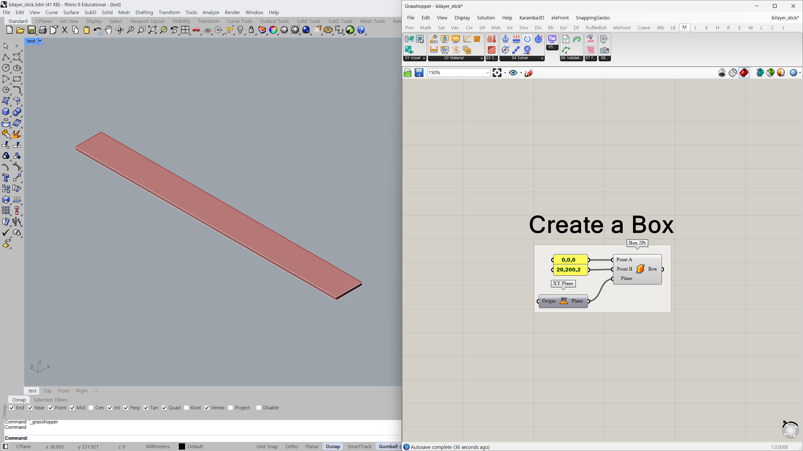
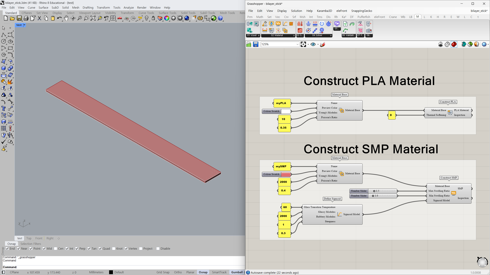
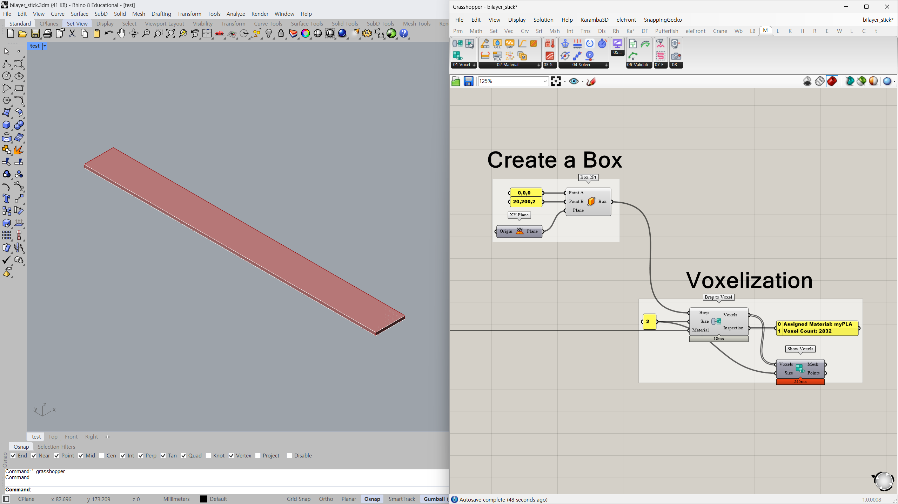
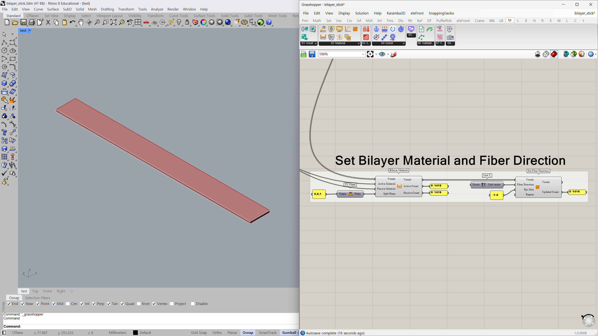
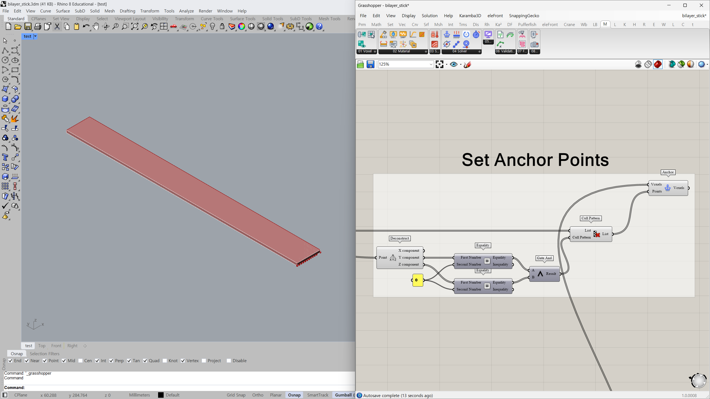
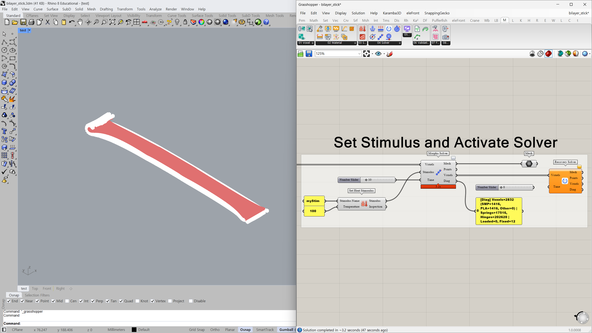
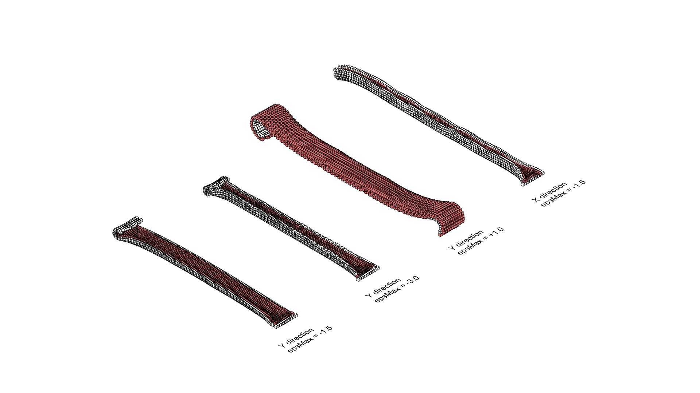

# **01.2 Quick Start Tutorial**
{: .no_toc}

# Bilayer Stick Simulation
{: .no_toc}

For those who want to see 4D printing results immediately or understand how it works, this is the simplest and fastest simulation example to test Morpho4D.

## Step01 Create a Simple Box
{: .no_toc}

Let's start by creating a simple box geometry in Rhino.
You can generate the geometry using either Grasshopper components or the Rhino Box command.
For this tutorial, create an elongated box measuring $20 \times 200 \times 2\text{ mm}$. Using the Small Objects - Millimeters template in Rhino is recommended for optimal accuracy.

## Step02 Construct Materials
{: .no_toc}

Next, define the properties for your test materials.
All materials in Morpho4D must be created using the `Material Base` component.
While you can input your own characterization data if you have lab test results, recommended default values for SMP simulation are pre-configured in this file for a quick setup.

## Step03 Voxelization
{: .no_toc}

Next, voxelize the Brep box geometry you created in the first step.
Voxels act as spatial point objects, but function as data containers holding multiple attributes such as materials, thermal stimuli, and boundary conditions.
Connect the Brep geometry to the `Brep to Voxel` component, and use `Show Voxels` if you wish to visualize the generated voxels.
Connect the `Material` input to the PLA material to initialize the baseline material properties.
A Voxel Size of 2(mm) is recommended for optimal simulation stability.

## Step04 Set Bilayer Material and Fiber Direction
{: .no_toc}

Now, configure the bilayer structure using the `Bilayer Material` component.
Connect the SMP material to the `Active Material` input and the PLA material to the `Passive Material` input.
Set the `Split Plane` to the XY-plane with an origin at (0,0,1) to differentiate the upper and lower materials.
Finally, customize the fiber direction and epsMax parameters.
This step is crucial, as these values dictate both the direction and magnitude of the deformation response.

## Step05 Set Anchor Points
{: .no_toc}

If you run this simulation without fixing any voxels in place, the model will fly away.
Conversely, over-constraining the model can cause numerical divergence (the simulation may explode).
Therefore, it is recommended to set appropriate anchor points.
In this case, anchor points are assigned to the voxels along one edge of the box.

## Step06 Set Stimulus and Activate Solver 
{: .no_toc}

You need to set a heat stimulus because SMP material activates when it reaches its glass transition temperature.
Make sure to set the stimulus temperature higher than the $T_g$ value you specified earlier.
After that, connect all created voxels and stimuli into `Morpho Solver` component, and set the time step for the simulation.
You will obtain the deformed mesh geometries as the 4D printing result.
If you want to visualize the shape memory feature of the SMP, use the `Recovery Solver` component by running the time step in reverse.

## Step07 Compare the Various Test Cases
{: .no_toc}

Feel free to adjust the parameter values to explore a variety of test cases.
If you have access to a 3D printer, you can print the test models and validate your physical results against the Rhino/Grasshopper simulations.